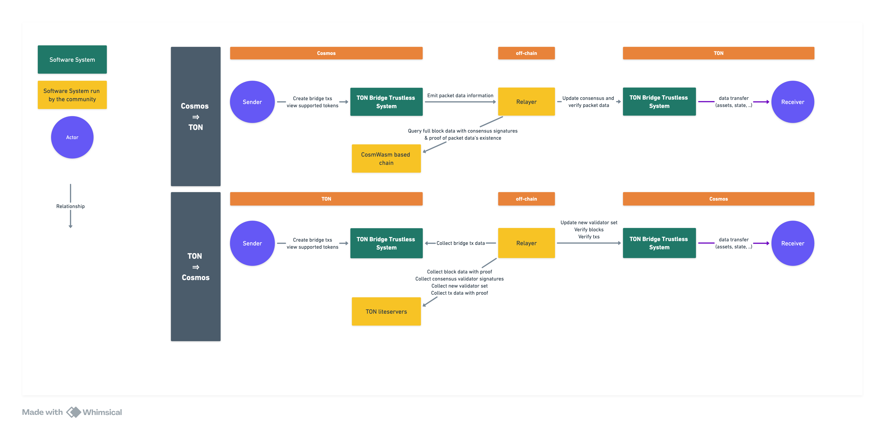
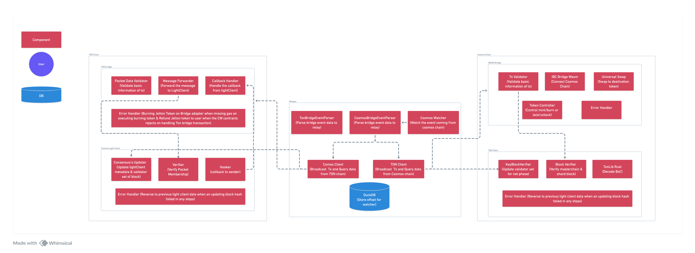
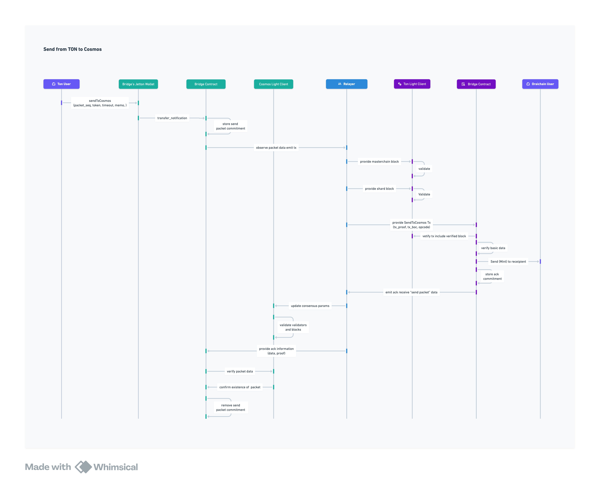
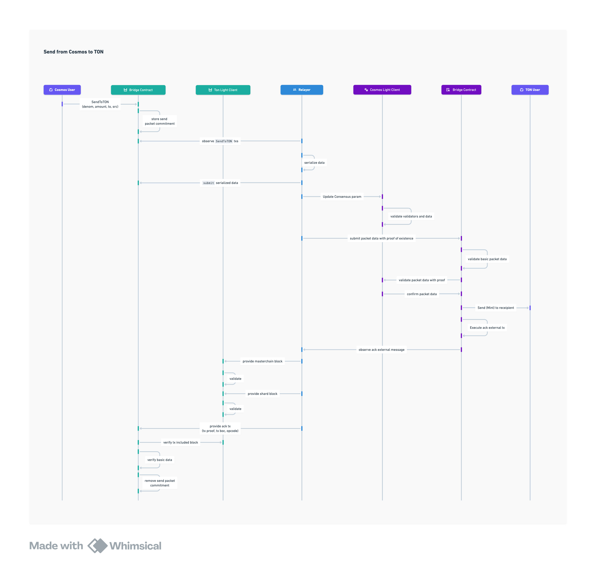

# TON Bridge


<aside>
🎯 This document describes the goals and expectations of TON Bridge to the Cosmos Ecosystem. It also outlines the MVP definition of the project as well as providing several top-level designs of the system.

</aside>

---

# Overview

`TON Bridge` aims to create a trustless tunnel that allows users to bridge and swap TON tokens to the Cosmos Ecosystem and vice versa in one step.

The system makes sure to validate every transaction using light clients and merkle proofs via decentralized relayers, opening endless possibilities bringing the Cosmos Ecosystem to TON and vice versa.

Anyone can become a relayer who validates transactions and receive relayer fees as a reward.

# Abstraction

## Problem statement

- No known-to-date TON Bridge to the Cosmos Ecosystem.
- TON is currently not IBC-compatible.
- The current official TON Bridge to and from EVM networks are non-trustless & closed-source
- The RSquad team wrote two papers to design a trustless bridge system, but:
  - The source is outdated, buggy, and not production-ready.
  - TON → Cosmos Ecosystem:
    - There’s no Rust or Go library that fully implements the RSquad’s paper.
    - There’s also no CosmWasm contract that implements the paper.
  - Cosmos Ecosystem → TON:
    - No Func contract that implements the trustless system.
    - The design and implementation must match with the consensus model of Cosmos Ecosystem, not Ethereum.

<aside>
💡 We need to design and implement a trustless, decentralized, and verifiable system that connects TON with the Cosmos Ecosystem.

</aside>

## Understanding concepts

Our trustless TON Bridge is heavily influenced by [RSquad Blockchain Labs Trustless System](#rsquad-blockchain-labs-trustless-system)

About TON blockchain, recommend to check on our articulated document [TON Blockchain 101](./ton-blockchain-101.md)

Light client concept which is used to verify blocks, validators from both Oraichain and Ton Network is inspired from [IBC client standard](#understand-cosmos--ibc)

### TON → Cosmos

- Each TON transaction is either included in a shard block or a masterchain block
- A shard block reference may or may not be included into a masterchain block.
  - A masterchain block only includes references to the latest shard blocks within a specific logical time.
  - The latest shard block will include references to the previous shard blocks so that these blocks are also verifiable.
  - Example
    ```markdown
    - Has shard block 100, 101, 102 of shard 2000 from logical time 1 to 5.
    - Has shard block 200 of shard 1000.
    - Masterchain block only includes references of shard block 102 and shard 200.
    - Shard block 102 includes a reference to shard block 101, and the shard block 101 includes 100's reference and so on.
    ```
- Each masterchain block is verified by a set of validators (PoS)
- Each masterchain keyblock contains the next set of validators within the 2-hour window after a consensus round has finished.

<details>
   <summary><b> Question: How to process an arbitrary TON transaction for bridging? </b></summary>

1. Trusted setup - initial trusted validator set when initializing the contracts

   → Have a trusted validator set for validating current consensus round’s masterchain blocks.

2. When the next validator set appear in a keyblock

   1. Validate the keyblock using the current validator set
   2. Update the new validator set by parsing the keyblock

   → Have an updated validator set for validating both current and next consensus round’s masterchain blocks.

3. Validate the target masterchain block using the current active validator set.

   → Have a set of validated masterchain blocks stored on-chain.

4. Validate shard blocks included in the validated masterchain block above using merkle proofs:

   1. The merkle proof’s hash of the shard block referenced in the masterchain must equal to the masterchain’s block hash, which is verified above using the validator signatures.
   2. The remaining shard blocks are recursively verified by proving that its merkle proof’s hash is the block hash of the previously verified shard block.

   → Have a set of validated shard blocks stored on-chain

5. Validate the transaction:

   1. Prove that the transaction merkle proof’s hash of the transaction equals to the verified shard block above.
   2. Parse the transaction data and calculate its tx hash. The hash must match the hash stored in the transaction merkle proof.
   3. The transaction must come from the trusted Bridge Adapter contract on TON.

   → Have the target transaction validated.

6. Process the transaction:

   1. Parse the transaction body and collect data
   2. Validate the data and continue processing.

   → Have the target transaction validated, processed, and stored on-chain to prevent replay attack.

</details>

### Cosmos → TON

- A full block queried from RPC contains:
  - All kinds of hashes for merkle proof validations from the block header (block hash, app hash,…).
  - Validator addresses and signatures.
  - Proof of packet existence based on key store inside state of blockchain at that block.
- We can use such data to:
  - Verify if a packet data is existed at a specific block based on app hash and proof of packet’s existence. ([ICS23](https://github.com/cosmos/ibc/tree/main/spec/core/ics-023-vector-commitments))\*\*
  - Verify if a block is valid by validating it against the validator signatures.

<details>
   <summary><b>Question: How to process an arbitrary CosmWasm transaction for bridging?</b></summary>

1. Trusted setup - initial trusted validator set on the CosmWasm based network when initializing the contracts.

   → Have a trusted validator set for validating current block.

2. Validate the block that includes the target transaction:

   1. Use the current validator set, validate against the signatures in the block data.
   2. After validation, store the new validator set.

   → Have the validated block stored on-chain.

3. Validate the transaction:

   1. Hash the raw transaction & compares with target transaction hash (should match)
   2. Get the transaction’s merkle proof.
   3. Calculate the merkle proof’s root hash & compare with the block’s data hash (should match)

   → Have the target transaction validated.

4. Process the transaction:

   1. Parse the transaction body and collect data
   2. Validate the data and continue processing.

   → Have the target transaction validated, processed, and stored on-chain to prevent relay attack.

</details>

## Why we’re making this

With a reported over 700 million monthly active users on Telegram. The evolving of The Open Network (TON) eco-system is undeniable.

The success of top-tier projects like $unibot and $MEVFree (boasting monthly incomes exceeding $5 million, during bear marketing) not only proved high-demand from Telegram users, but also TON eco-system provide a lot success enablers to developers, such as:

- **TON's Native Payment:** with @Wallet
- **Telegram Community Promotion:** de-facto option for Crypto/Blockhain communities
- **Room for enhancing User Experience:** More than Bot + API + Mini App

With rapid growth of TVL of TON (from $71M to $994M in first half of 2024), We (Oraichain Labs) see it a huge potential for DeFi opportunities between Cosmos eco-system & TON eco-system - which currently being limited by official TON Bridge is only support Ethereum & BNB Chain.

- Move assets from across eco-systems natively
- Allow users on TON eco-system to interact with Cosmos eco-system’s DeFi products
- Introduce new liquidity opportunities

## Our Works

| Repository                                          | Description                                                                                                                                                                                                                                                             |
| --------------------------------------------------- | ----------------------------------------------------------------------------------------------------------------------------------------------------------------------------------------------------------------------------------------------------------------------- |
| https://github.com/oraichain/tonbridge-relayer      | A decentralized middleware server that bridges the TON blockchain to Oraichain/Cosmos blockchains. It is responsible for delivering packets from TON or Oraichain/Cosmos, and can be compared to an IBC relayer.                                                        |
| https://github.com/oraichain/ton-contracts          | Func smart contracts which control Oraichain/Cosmos block validation and transactions, creating a trustless and secure interoperability environment on TON.                                                                                                             |
| https://github.com/oraichain/tonbridge-cw-contracts | CosmWasm smart contracts. These contracts are in charge of TON's block validation and transaction management, ensuring a trustless and secure interoperability environment on Oraichain/Cosmos.                                                                         |
| https://github.com/oraichain/tonlib-rs              | Rust library that interacts with the TON blockchain. It gives developers the tools they need to interface with the TON blockchain through their Rust apps. This library has been improved and refined for usage in the Cosmwasm contract for cell parsing and encoding. |
| https://toncenter.orai.io/                          | A server similar to the LCD server in the Cosmos environment. It is used to query and execute data on the TON blockchain, giving users a reliable interface for dealing with the blockchain.                                                                            |

# Solution Design

## 1. System level



## 2. Components level

<aside>

🎯 [Follow graphics guideline by TON](https://docs.ton.org/contribute/docs/schemes-guidelines)

</aside>



## 3. Implementation Level

**From TON → Cosmos**



**From Cosmos → TON**



[Sequence diagrams for verifying TON light client](./ton-light-clients-verification.md)

# Common failures & recovery methods

### Relayer

1. RPC nodes from Cosmos stop running due to network or connection errors.
2. Memory leaks.
3. Relayer wallets run out of native coins to pay for the fees.
4. TON’s lite client or Toncenter fails to return responses due to network or connection errors.
5. Cannot query proof due to pruned data.

<details>

<summary><b>Solutions</b></summary>

1. Manage RPC nodes using pm2 and notifies via Discord when having problems.
2. Manage the relayer via pm2 to have auto restart if there’s a leak, monitor RAM usage.
3. Use Authz to grant the relayer to spend fees from the granter wallet. Monitor the granter’s wallet balance.
4. The relayer notifies connection errors via Discord.
5. Manually investigate the case via transaction hash and sequence number.

</details>

### Cosmos → TON

1. Packet is expired.
2. No acknowledgement from TON to clean up data.
3. Cosmos Tx failed but still included in a block.
4. The Jetton Bridge contract runs out of tokens to unlock to the receiver.
5. Cosmos Tx timestamp versus current timestamp gap is larger than the trusting period.

<details>

<summary><b>Solutions</b></summary>

1. When packet is timeouted, the Ton contract will emit ack packet for the Cosmos Contract to refund users.
2. If no acknowledgement passed timeout → The relayer will update the packet’s status based on timeout proof → handle manually.
3. Ton Adapter queries the Cosmos contract state with proof to verify if the packet is successful or not.
4. Use a bot to listen to the contract’s balances.
5. Ignore the tx.

</details>

### TON → Cosmos

- Packet is expired.
- No acknowledgement from Cosmos to clean up data.
- Could not validate and update new validator set.
- The bridge contract runs out of tokens to unlock to the receiver.
- The block’s validator signatures are not greater than 2/3 of the total voting power.

<details>

<summary><b>Solutions</b></summary>

1. When packet is time-outed, the Cosmos contract will emit ack packet for the Ton Contract to refund users.
2. If no acknowledgement passed timeout → The relayer will update the packet’s status based on timeout proof → handle manually.
3. Manually update new validator set based on previous round, then update the current round to make it work. @Trung Nguyen Van
4. Use a bot to listen to the contract’s balances.
5. Ignore the tx.

</details>

# References

### RSquad Blockchain Labs Trustless System:

- [TON -> Cosmos](https://docs.ton.org/trustless-interaction-with-ton_v1.1_23-05-15.pdf)
- [Cosmos -> TON](https://docs.ton.org/ton-trustless-bridge_tvm-and-zk_v1.1_23-05-15.pdf)

### Understanding TON concept

[TON Blockchain 101](./ton-blockchain-101.md)

### Understand Cosmos / IBC

- `Cosmos` term mentioned above mean Cosmos-based blockchains or Cosmos ecosystem
- IBC specifications
  - [ICS23 Proof merkle format for IBC](https://github.com/cosmos/ibc/tree/main/spec/core/ics-023-vector-commitments)
  - [ICS02 Client Semantics](https://github.com/cosmos/ibc/blob/main/spec/core/ics-002-client-semantics)

# Disclaimer

> ⚠ **This software is distributed on an "AS IS" BASIS, WITHOUT WARRANTIES OR CONDITIONS OF ANY KIND, either express or implied.**

Or plainly spoken - this is a very complex piece of software which targets a bleeding-edge, experimental smart contract runtime. Mistakes happen, and no matter how hard you try and whether you pay someone to audit it, it may eat your tokens, set your printer on fire or startle your cat.

Cryptocurrencies are a high-risk investment, no matter how fancy.
