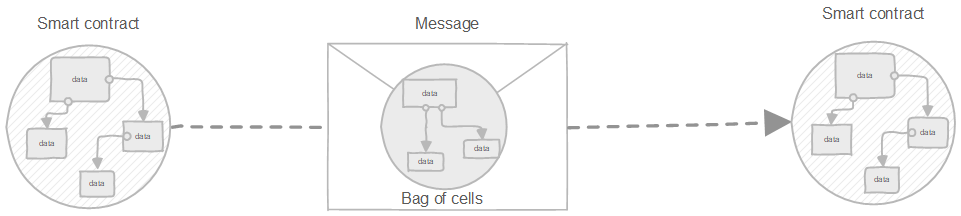
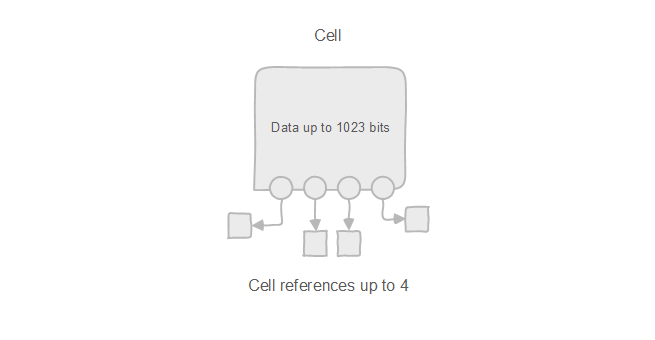
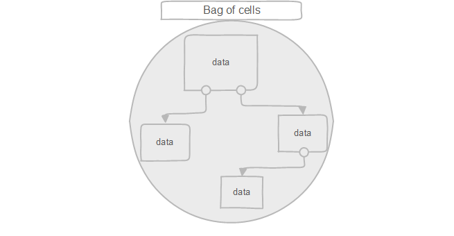

# TON Blockchain 101

<aside>
🎯 This document attempts to summarize key concepts of TON blockchain. 
Articulated during process of making TON Bridge by Oraichain Labs developers

</aside>

# Common terminology

| Term | Definition |
| --- | --- |
| TON actor | Like “smart contract”. Even user wallets are contracts.
Actor properties (including but not limited to):
    ◦ Unique address
    ◦ Code
    ◦ Data
    ◦ Balance |
| Transaction | A set of steps to modify actor’s properties. Transactions are ordered. |
| Chain | Sequence of transactions |
| AccountChain | Sequence of transactions for a single address |
| Blocks | Batch a set of transactions |
| ShardChain | A set of blocks including transactions of a set of accounts
Can merge (aggregate) or split ShardChains. Allow up to 2^60 shard chains |
| Blockchain 
(called Workchain) | an aggregation of ShardChains with common set of rules
Ton allows many blockchains with diff set of rules (2^32 blockchains) |
| MasterChain | Chain for multichain state checkpoint

• Masterchain blocks - blocks of the masterchain that include shard blocks of different workchains within a logical time (lt) range. 
• A masterchain block does not include all shard blocks of a workchain, but only the highest-seqno shard block in that lt range.
• Masterchain is also a workchain with wc = -1 |
| Key block | Key block is a masterchain block containing prev, cur, and next validator sets |

# Quickly TON blockchain

## Consensus algorithm

<aside>

💡 Refer to [The TON Blockchain is based on PoS consensus](https://gist.github.com/awesome-doge/9bd53050077701e8321d06c0a8ded172) for detail

</aside>

1. Ton uses BFT → each block should have > 2/3 voting power
2. Split consensus into multiple validation sessions
    1. Each session lasts about 18 hours (config params #15 in base 10)
    2. An election round is created to start a new session
        1. Election process takes around 7 hours (also config params #15)
        2. Send TON using special tx to election contract to participate
        3. After an election, has 2 hours before the session starts (also config params #15) → refund TON if not elected & show list of next validators when querying config & keyblock
3. Number of validators (config params #16 in base 10)
    1. Has a maximum global number of validators (current is 400 vals)
    2. Has a maximum main number of validators for each session. Current is 100 main vals. Chosen from the pool of max validators (pseudorandom)
    3. Main validators validate masterchain blocks
    4. The rest validate shard blocks
    5. Validators of each block is pseudorandom, but best effort to pick as many as possible.

## **Smart Contracts**

- `Components`: <workchain_id (1 byte)><account_id (32 bytes)>
- `Account ID` : sha256(compiled_code, initital_state)
- `User friendly version (36 bytes)`: <flags (1 byte)><workchain_id><account_id><verification (2 bytes)>
    - `flag` - isBounceable (if cannot send to then “bounce” fund back to sender); isTestnetOnly, isUrlSafe
    - `verification` - CRC16-CCITT signature from the previous 34 bytes
    - Then we base64(36 bytes) to get friendly address

## Development concept

<aside>
💡 On TON, everything consists of cells, including contract code, stored data, blocks, achieving streamline and robust flexibility in the process.

</aside>

### Cells[****](https://docs.ton.org/develop/data-formats/cell-boc#cell)

Cells are entities in Ton for data storage. 

- max = 1023 bits per cell
- max 4 references to other cells
- No circular ref with
- Form DAG
- 5 types of cells

### Bag of Cells (BoC)[****](https://docs.ton.org/develop/data-formats/cell-boc#bag-of-cells)

A format to 

- Serializing cells into bytes arrays
- Contracts send `BoC` to others

### TL-B (Type Language - Binary)

<aside>

💡 Serves to describe the type system, constructors and existing functions. 
E.g TL-B schemes used to build binary structures associated with TON Blockchain

</aside>

- Language: [TL-B](https://docs.ton.org/develop/data-formats/tl-b-language)
- Type: [TL-B Types](https://docs.ton.org/develop/data-formats/tl-b-types)

### Ton FunC tutorials:

<aside>
💡 A high-level language FunC is used to program smart contracts on TON: domain-specific, C-like, statically typed language.

</aside>

1. [Learning FunC](https://github.com/romanovichim/TonFunClessons_Eng)
2. FunC standard library **-** 

# Best practices

1. **Contract Sharding:** 
    
    [https://tonhelloworld.com/02-contract/](https://tonhelloworld.com/02-contract/)[https://blog.ton.org/how-to-shard-your-ton-smart-contract-and-why-studying-the-anatomy-of-tons-jettons](https://blog.ton.org/how-to-shard-your-ton-smart-contract-and-why-studying-the-anatomy-of-tons-jettons)
    

# References

1. [En:Free TON Wiki | Freeton Wiki | Fandom](https://freeton.fandom.com/wiki/En:Free_TON_Wiki)
2. https://github.com/ton-community/awesome-ton
3. [**The TON Blockchain is based on PoS consensus.md**](https://gist.github.com/awesome-doge/9bd53050077701e8321d06c0a8ded172) 
4. https://docs.ton.org/develop/data-formats/tl-b-language
5. https://docs.ton.org/develop/data-formats/tl-b-types
6. https://github.com/romanovichim/TonFunClessons_Eng
7. https://docs.ton.org/develop/func/stdlib
8. https://tonviewer.com/config