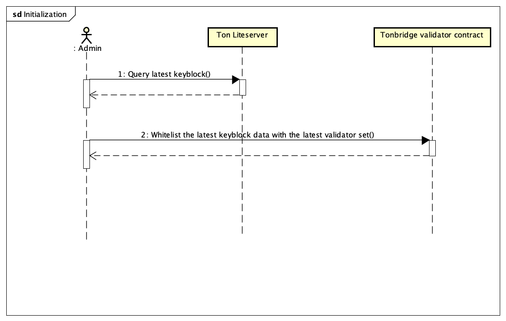
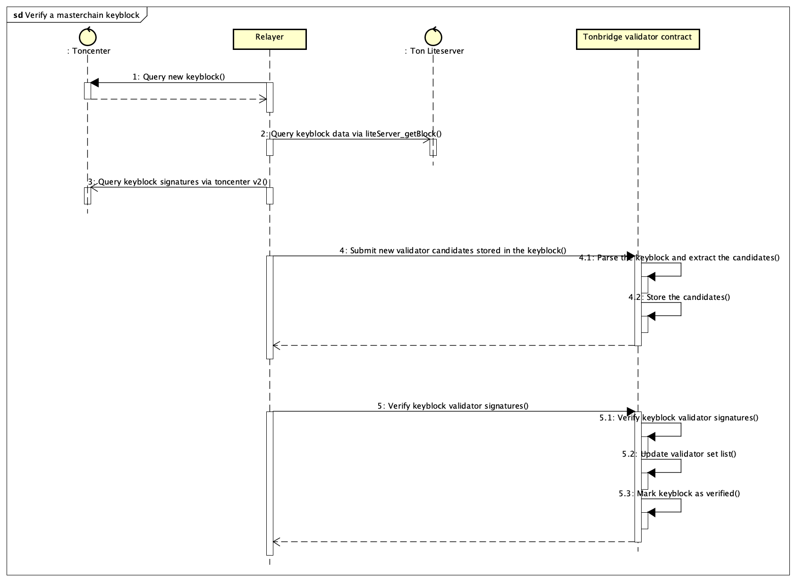
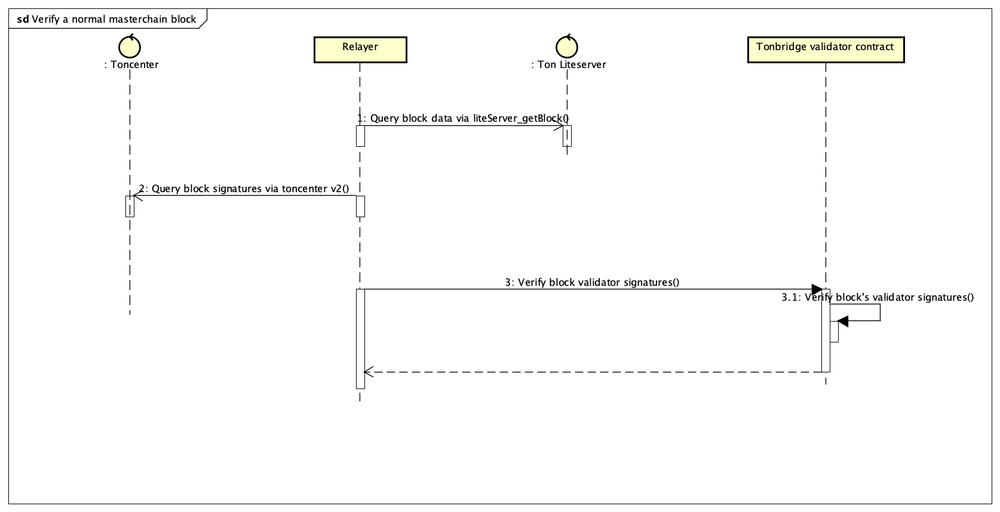
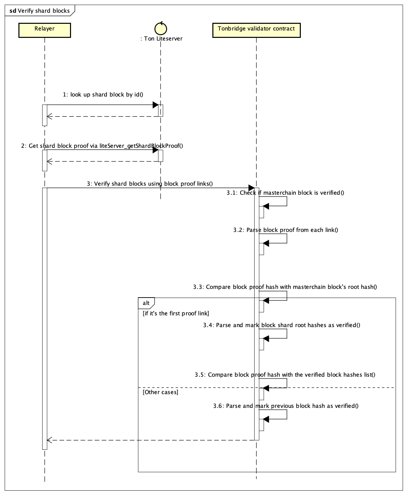
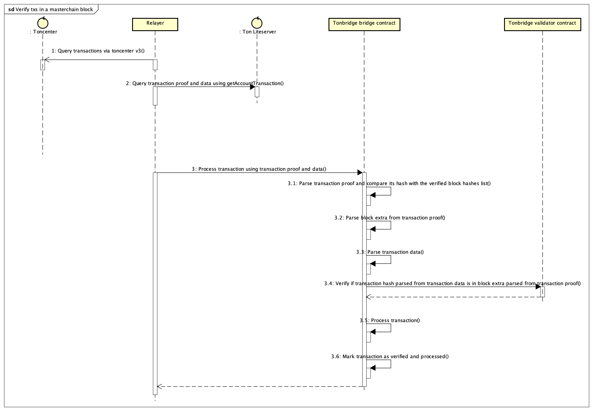
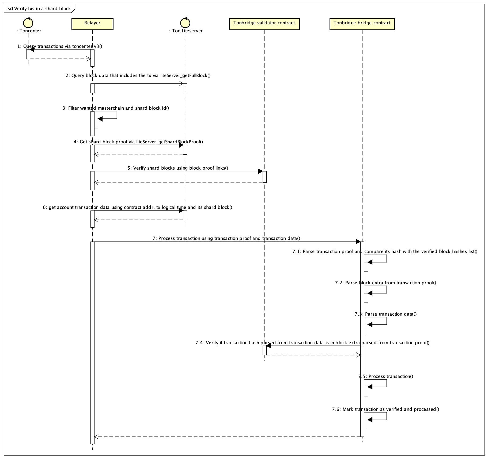

# Ton Bridge detailed design

[Ton → CosmWasm]

Test case:

- tx: [Transaction · 25d1…f5fd (tonviewer.com)](https://tonviewer.com/transaction/25d1ed22d37fa5ec44b4426f00f33ee3f59e527e8252b9da266172d342c0f5fd)
- from shard block: [Block · (0:2…169) (tonviewer.com)](<https://tonviewer.com/block/(0,2000000000000000,43884169)>)
- only the next shard block (170): [Block · (0:2…170) (tonviewer.com)](<https://tonviewer.com/block/(0,2000000000000000,43884170)>) is included in the masterchain block
- masterchain block: [Block · (-1:…891) (tonviewer.com)](<https://tonviewer.com/block/(-1,8000000000000000,38215891)>)

Diagrams:

- Initialization step. We need to whitelist and trust the initial validator set as well as the initial keyblock.



- Verify a masterchain keyblock: This step is required since after each keyblock, the validator set will be updated, so we need to make sure we need to validate every keyblock.



- Verify a normal masterchain block: This step is for verifying a transaction. There are two cases:
  - If a transaction is in the masterchain block → we will use validator signatures to verify the masterchain block. After that we only need to prove if the transaction is in that masterchain block by parsing BlockExtra → we are done.
  - If a transaction is in a shard block → we will need to verify the masterchain block that includes the shard block first.
  
- Verify shard blocks



- Verify transactions in a masterchain block



- Verify transactions in a shard block (Most complex)



**Define schema for both flow ton→cosmos and vice versa:**

## Ton → Cosmos:

### TON’s Packet transfer**:**

```rust
{

	opcode_packet: u32, // crc32("op:send_to_cosmos")

	seq: u64, // TON packet seq

	token_origin: u32, // crc32

	local_amount: u128,

	timeout_timestamp: u64,

	remote_receiver_byte_len: u8

	remote_receiver : string (bit size:  remote_receiver_bit_len ), (recovery address)

	local_denom: TonAddress (bit size: local_denom_bit_len),

	ref: {
	  local_sender: TonAddress (bit size: 267),
	},

	ref: {
		universal_swap_msg: {
			dest_denom_byte_len: u8,
			dest_denom: string,
			dest_receiver_byte_len: u8,
			dest_receiver: string,
			dest_channel_len: u8,
			dest_channel: string,
		}
	}
}
```

### Packet ack commitment (on Cosmwasm)

```rust
{
	opcode_packet: u32, // crc32("op:send_to_cosmos")

	seq: u64, // TON packet seq

	token_origin: u32, // crc32

	local_amount: u128,

	timeout_timestamp: u64,

	remote_receiver_byte_len: u8

	remote_receiver : Bech32 (bit size:  remote_receiver_bit_len ), (recovery address)

	local_denom: TonAddress

	status: 0 | 1 | 2 (success | error | timeout)

	ref: {
	  local_sender: TonAddress (bit size: 267),
	},
}
```

### Ack Events (on Cosmwasm)

```rust
// these are required attrs, may extend to provide more information
{
 action: "send_to_cosmos",
 opcode_packet: u32 // crc32("op:send_to_cosmos")
 seq: u64, // TON packet seq
 ack: 0 | 1 | 2 (success | error | timeout)
}
```

## Cosmos → Ton:

### Cosmos Packet Transfer

```rust
{
	opcode_packet: u32, // crc32("op:send_to_ton")

	seq: u64, // Cosmos packet seq

	token_origin: u32,

	remote_amount: u128,

	timeout_timestamp: u64,

	remote_receiver : TonAddress (bit size: 267),

	remote_denom: TonAddress (bit size: 267 ),

	ref: {
	  ****local_sender**_byte_len: u8,**
	  local_sender: Bech32,
	}
}
```

### Cosmos Packet Transfer Commitment = cell_hash(Cosmos Packet Transfer)

### Packet Transfer Event (Contract Cosmos emit)

```rs
{
	action: "send_to_ton",

	opcode_packet: u32 // crc32("op:send_to_ton")

	seq: u64, // Cosmos packet seq

	token_origin: u32,

	remote_receiver: TonAddress (bit size: 267),

	remote_denom: TonAddress (bit size: 267 ),

	remote_amount: u128,

	timeout_timestamp: u64,

	local_sender: Addr,
}
```

### Ack or events (TON)

```rust
{
	opcode_packet: u64,  // crc32("op:send_to_ton")
	seq: u64, // Cosmos packet seq
	status: 2bits  0 | 1 | 2 (success | error | timeout)
}
```
