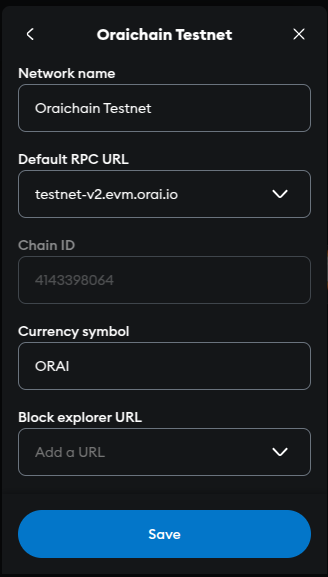

# How To Convert ORAI ERC20 To BEP20 And Vice Versa?

### How To Connect MetaMask To Binance Smart Chain?

&#x20;Given that you’ve already had your **MetaMask wallet** logged into with your personal credentials, you’ll be able to see the interface of [**https://bridge.orai.io/**](https://bridge.orai.io) with a series of conversion options.



&#x20;For the time being, ORAI tokens are available in two types - **ERC20** and **BEP20**. The **ORAI native tokens** are set to come in the coming days then ORAI tokens will coexist in every aforementioned shape and form within Oraichain’s ecosystem.


&#x20;As the origin of BEP20 ORAI tokens traces back to the **Binance Smart Chain** network (also known as **BSC**) and MetaMask doesn’t come bundled with Binance Smart Chain by default at the moment, you need to configure your wallet a bit in advance.

Follow some simple steps below to install the Binance Smart Chain network in your MetaMask wallet:

&#x20;**Step 1**: Click on the MetaMask icon and select **Settings** from the dropdown menu.

.png>)

(Otherwise, you can open the full-screen view of **Settings**: **Three-dot menu** > **Expand view**)

**Step 2**: Navigate to the **Networks** menu and tap on the **Add Network** option at the top-right corner.

.png>)

&#x20;**Step 3**: Below are the parameters to fill in for each section:

```
**Network Name**: Binance Smart Chain

**New RPC URL**: https://bsc-dataseed.binance.org/

**ChainID**: 56

**Symbol**: BNB

**Block Explorer URL**: https://bscscan.com
```

&#x20;Click **Save** and your wallet will get integrated into the Binance Smart Chain’s mainnet. You’re good to go now!

.png>)

### How To Convert ORAI ERC20 To BEP20 And Vice Versa?

First things first, keep in mind that you’ve already deposited a certain amount of ORAI tokens, either ERC20 or BEP20, to the wallet address that is currently being in use.

Whether your ORAI tokens are stored in the form of ERC20 or BEP20, you can see them when choosing **Main Ethereum Network** or **Binance Smart Chain** respectively.

If this is the first time you set up the BSC network, you need to add ORAI BEP20’s address manually by using **Add Token** > _Custom Token_.

.png>)

The official addresses of ORAI ERC20 and ORAI BEP20 are as follows:

```
**ORAI ERC20: 0x4c11249814f11b9346808179cf06e71ac328c1b5**

**ORAI BEP20: 0xa325ad6d9c92b55a3fc5ad7e412b1518f96441c0**
```

**Disclaimer**: To avoid unwilled losses or scams, you must enter the addresses properly.

Now, just keep reading to finalize the process of converting ORAI tokens on [**https://bridge.orai.io/**](https://bridge.orai.io):

**Step 1**: Scroll down and choose **I agree to the Terms of Use and the Privacy Policy**.

.png>)

**Step 2**: Open **MetaMask** and choose the corresponding network based on your token type (ERC20 or BEP20).

**Step 3**: Click on the option that suits your needs.

**Step 4**: Copy and paste your BEP20/ERC20 address into the **Address** field.

.png>)

Check out both the **disclaimers** present below it then tick them off.

**Step 5**: Enter the amount of ORAI tokens you want to swap, then click **Next**.

**Step 6**: Verify information and submit your swapping request.

.png>)

&#x20;**Note**: After your submission, your swapping request will be reviewed manually due to security purposes. If successful, you’ll receive ORAI BEP20 or ERC20 tokens in the registered wallet address **within up to 7 business days**.
