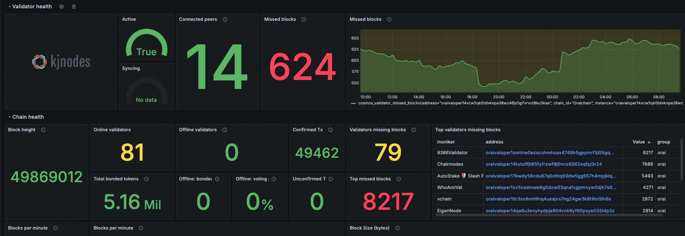

# **Monitor Your Oraichain Validator Node by Grafana**



## **Prerequisites**
Before proceeding, ensure you have:
- **A running Oraichain validator node**
- **[Grafana](https://grafana.com) installed**
- **[Prometheus](https://prometheus.io) installed**

---

## **Step 1: Change Node Configuration**
Modify the configuration file to enable Prometheus.

```sh
nano ~/.oraid/config/config.toml
```

Find and update the `[instrumentation]` section:

```toml
[instrumentation]
prometheus = true
prometheus_listen_addr = ":26660"
max_open_connections = 3
namespace = "tendermint"
```

Then **restart your node** to apply the changes.

```sh
sudo systemctl restart oraid
```

The **Prometheus endpoint** will now be available on **port `26660`**.

---

## **Step 2: Setup Cosmos Exporter**
[`cosmos-exporter`](https://github.com/solarlabsteam/cosmos-exporter) collects validator metrics.

### **1. Download and Install**
```sh
wget https://github.com/solarlabsteam/cosmos-exporter/releases/download/v0.3.0/cosmos-exporter_0.3.0_Linux_x86_64.tar.gz
tar xvfz cosmos-exporter_0.3.0_Linux_x86_64.tar.gz
sudo mv ./cosmos-exporter /usr/bin/
sudo rm cosmos-exporter_0.3.0_Linux_x86_64.tar.gz
```

### **2. Create a Systemd Service**
```sh
sudo nano /etc/systemd/system/cosmos-exporter.service
```

Insert the following configuration (update the **gRPC endpoint** and **listening port `9300`** accordingly):

```ini
[Unit]
Description=Cosmos Exporter
After=network-online.target

[Service]
User=root
TimeoutStartSec=0
CPUWeight=95
IOWeight=95
ExecStart=cosmos-exporter --bech-account-prefix=orai --bech-account-pubkey-prefix=oraipub --bech-consensus-node-prefix=oraivalcons --bech-consensus-node-pubkey-prefix=oraivalconspub --bech-validator-prefix=oraivaloper --bech-validator-pubkey-prefix=oraivaloperpub --denom=orai --denom-coefficient=1000000 --listen-address=:9300 --log-level=debug --node=localhost:9090
Restart=always
RestartSec=2
LimitNOFILE=800000
KillSignal=SIGTERM

[Install]
WantedBy=multi-user.target
```

### **3. Enable and Start the Service**
```sh
sudo systemctl enable cosmos-exporter
sudo systemctl start cosmos-exporter
sudo systemctl status cosmos-exporter
sudo journalctl -u cosmos-exporter -f --output cat  # View logs
```

The Cosmos Exporter service is now **running on port `9300`**.

---

## **Step 3: Update Prometheus Configuration**
Edit your Prometheus configuration file:

```sh
nano /etc/prometheus/prometheus.yml
```

Add the following scrape jobs:

```yaml
scrape_configs:
  - job_name: "cosmops"
    static_configs:
      - targets: ["localhost:26660"]
        labels:
          group: "cosmops"

  - job_name: "validators"
    metrics_path: /metrics/validators
    static_configs:
      - targets: ["localhost:9300"]
        labels:
          group: "orai"

  - job_name: "validator"
    scrape_interval: 15s
    metrics_path: /metrics/validator
    static_configs:
      - targets:
          - oraivaloper100000000000000000000000000000000000000
    relabel_configs:
      - source_labels: [__address__]
        target_label: __param_address
      - source_labels: [__param_address]
        target_label: instance
      - target_label: __address__
        replacement: localhost:9300
```

This configuration:
- Scrapes **your node's metrics** from **port `26660`**.
- Collects **Cosmos Exporter metrics** from **port `9300`**.
- Separates **all validators** from **your validator** for detailed monitoring.
- Change `oraivaloper1000` to your own validator address.

Restart Prometheus to apply the changes:

```sh
sudo systemctl restart prometheus
```

---

## **Step 4: Configure Grafana**
### **1. Access Grafana**
Open your browser and go to grafana webUI.

### **2. Import the Cosmos Validator Dashboard**
1. Go to **Dashboards** → **Import**.
2. Enter the **Dashboard ID**: `15991`.
3. Select **Prometheus** as the data source.
4. Click **Import**.

Your Cosmos validator monitoring dashboard is now live! 🎉

---

## **Step 5: Summary of Steps**
| Step | Task | Description |
|------|------|-------------|
| 1 | **Enable Prometheus in Node** | Exposes metrics on port **`26660`** |
| 2 | **Install Cosmos Exporter** | Collects validator data on port **`9300`** |
| 3 | **Update Prometheus Config** | Scrapes **both `26660` and `9300`** |
| 4 | **Setup Grafana Dashboard** | Displays metrics with **Dashboard ID: `15991`** |

### **Ports Used**
| Service | Port | Purpose |
|---------|------|---------|
| **Cosmos Node Prometheus** | `26660` | Exposes node metrics |
| **Cosmos Exporter** | `9300` | Validator-specific metrics |
| **Prometheus** | `9090` | Metric collection |
| **Grafana** | `3000` | Dashboard UI |

---

## **Conclusion**
By following this guide, you’ve successfully set up monitoring for your Cosmos validator node using **Grafana, Prometheus, and Cosmos Exporter**. 

**Last tip**: Monitoring stack needs to be deployed on seperate machine to be able to notify in case if validator goes down! To run monitoring stack you dont need beastly server with multiple cores. It will be more than enough to run it on smallest available vps (example: Ubuntu 22.04 / 1 VCPU / 2 GB RAM / 20 GB SSD)