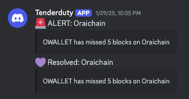

# What is Tenderduty?

**Tenderduty** is a monitoring tool specifically designed for validators in **Tendermint-based blockchains**, such as **Cosmos, Osmosis, and other related networks**. It helps track validator performance, ensuring they remain online, properly sign blocks, and avoid slashing or jailing. Tenderduty allows validators to monitor their node's health and receive alerts in case of issues like downtime, missed blocks, or risks of slashing.

### Key Features of Tenderduty:
- **Validator uptime and block signing performance monitoring.**
- **Alerts for missed blocks or downtime** (via email, Telegram, Discord, Slack, or PagerDuty).
- **Prevention of slashing risks** by identifying potential issues early.
- **A web interface** for viewing real-time statistics and logs.

Tenderduty is particularly useful for validators who need to ensure their node remains in good standing within the network. Downtime or misbehavior can result in penalties, including **slashing and jailing**.

---

# Installation

The [official Tenderduty repository](https://github.com/blockpane/tenderduty) is **archived**, but it is still a **useful monitoring tool for Cosmos validators** now and in the future.  

In this tutorial, I recommend using **Docker** to install and configure Tenderduty for monitoring a validator on a Tendermint-based blockchain.

### Prerequisites:
- **Operating System**: Linux (e.g., Ubuntu)
- **Docker**: Installed
- **Validator Node**: A running Tendermint-based node to monitor
- **Notification Service**: Tenderduty supports Discord, Telegram, Slack, and PagerDuty; you need a webhook or API key for notifications.

---

# Step-by-Step Guide

## 1. Create a Folder and `docker-compose.yml` File

First, create a directory for Tenderduty and navigate into it:

```bash
mkdir tenderduty
cd tenderduty
touch docker-compose.yml
touch config.yml
```

Then, add the following **Docker Compose** configuration to `docker-compose.yml`. This will set up Tenderduty with a web dashboard and Prometheus exporter.

```yaml
version: '3.2'
services:
  tenderduty:
    image: ghcr.io/blockpane/tenderduty:latest
    command: ""
    ports:
      - "8888:8888" # Web Dashboard
      - "28686:28686" # Prometheus Exporter
    volumes:
      - ./config.yml:/var/lib/tenderduty/config.yml
    logging:
      driver: "json-file"
      options:
        max-size: "20m"
        max-file: "10"
    restart: unless-stopped
```

If needed, you can **modify the exposed ports** (`8888` for the dashboard and `28686` for Prometheus).

---

## 2. Configure Tenderduty

Tenderduty requires a **configuration file** (`config.yml`) to specify the networks and validators to monitor.

### Open the Configuration File:
```bash
nano config.yml
```

### Example Configuration for **Oraichain** (Using **Discord Alerts**)

```yaml
---
enable_dashboard: yes
listen_port: 8888
hide_logs: no
node_down_alert_minutes: 3
node_down_alert_severity: critical
prometheus_enabled: yes
prometheus_listen_port: 28686

pagerduty:
  enabled: no
discord:
  enabled: yes
  webhook: https://discord.com/api/webhooks/999999999999999999/zzzzzzz
telegram:
  enabled: no
slack:
  enabled: no
healthcheck:
  enabled: no

chains:
  "Oraichain":
    chain_id: Oraichain
    valoper_address: oraivaloperXXXXXXXXXXXXXXXXXXXXXXXXXXXXXXXXXXXXXXX
    public_fallback: no
    alerts:
      discord:
        enabled: yes
        webhook: "https://discord.com/api/webhooks/999999999999999999/zzzzzzz"
    nodes:
      - url: tcp://localhost:26657
        alert_if_down: yes
      - url: https://rpc.orai.io:443
        alert_if_down: no        
```

**Explanation:**
- **Alerts are enabled via Discord.**
- **Two nodes are monitored**: 
  - `localhost:26657` (your own validator node) – raises alerts if down.
  - `rpc.orai.io` (fallback public RPC) – does not raise alerts.

For a full example configuration, check the [official sample](https://github.com/blockpane/tenderduty/blob/main/example-config.yml).

---

## 3. Start Tenderduty

After setting up the configuration file, start Tenderduty:

```bash
docker compose up -d
```

### Access the Web Interface:
Once running, visit **`http://localhost:8888`** in your browser to view the monitoring dashboard.

---

## 4. Monitoring & Alerts

Tenderduty will now:
- **Monitor your validator’s status** in real-time.
- **Send alerts** (via Discord, Telegram, Slack, etc.) if the node goes down or misses blocks.
- **Provide logs and metrics** accessible via the web dashboard.

To check the logs:
```bash
docker logs -f tenderduty
```

---

# Conclusion

Congratulations! 🎉 You have successfully set up **Tenderduty** to monitor your validator on a Tendermint-based blockchain. With Tenderduty running, you can **stay informed about validator health, avoid slashing risks, and react quickly to potential issues.** 🚀

For further customization, refer to the **official documentation** (though archived):  
👉 [Tenderduty GitHub Repository](https://github.com/blockpane/tenderduty)
