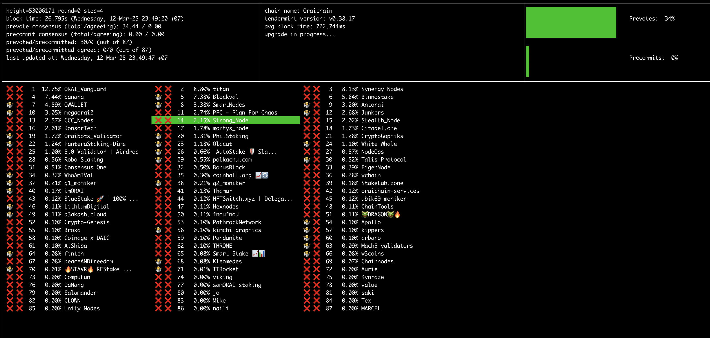

# **tmtop: Real-time Tendermint Node Monitoring**

`tmtop` is a powerful CLI tool designed to monitor **Tendermint-based blockchain nodes** in real-time. It provides live insights into your node’s performance, including block heights, peer connections, transaction rates, and more.

### **Repository:** [GitHub - QuokkaStake/tmtop](https://github.com/QuokkaStake/tmtop)

---
## **1. Installation**
You can install `tmtop` by building it from source.

### **Step 1: Clone the Repository**
```bash
git clone https://github.com/QuokkaStake/tmtop.git
cd tmtop
```

### **Step 2: Build the Binary**
```bash
go build -o tmtop
```

### **Step 3: Move the Binary to Your Path**
```bash
sudo mv tmtop /usr/local/bin/
```

Verify the installation:
```bash
tmtop --version
```

---
## **2. Running tmtop**

Once installed, start `tmtop` by running:
```bash
tmtop <NODE_RPC_ENDPOINT>
```

For example, if your node is running locally on port 26657:
```bash
tmtop http://localhost:26657
```

### **Common Flags**
| Flag | Description |
|------|-------------|
|--block-time-refresh-rate duration   | Block time refresh rate (default 30s)|
|--chain-info-refresh-rate duration   | Chain info refresh rate (default 5m0s)|
|--chain-type string                  | Chain type. Allowed values are: 'cosmos-rpc', 'cosmos-lcd', 'tendermint' (default "cosmos-rpc")|
|--consumer-chain-id string           | Consumer chain ID|
|--debug-file string                  | Path to file to write debug info/logs to|
|--disable-emojis                     | Disable emojis in output|
|--halt-height int                    | Custom halt-height|
|--help                               | help for tmtop|
|--lcd-host string                    | LCD API host URL|
|--provider-rpc-host string           | Provider chain RPC host URL|
|--refresh-rate duration              | Refresh rate (default 1s)|
|--timezone string                    | Timezone to display dates in|
|--upgrade-refresh-rate duration      | Upgrades refresh rate (default 30m0s)|
|--validators-refresh-rate duration   | Validators refresh rate (default 1m0s)|
|--verbose                            | Display more debug logs|
|--version                            | version for tmtop|

Example with a 5-second refresh rate:
```bash
tmtop http://localhost:26657 --refresh-rate=5
```

---
## **3. Troubleshooting**

### **Issue: Cannot Connect to RPC**
**Error:** `failed to fetch data from RPC`  
**Solution:** Ensure your node’s RPC endpoint is accessible. Try:
```bash
curl http://localhost:26657/status
```
If the request fails, check your firewall and node settings.

### **Issue: Incorrect Block Height**
If `tmtop` shows an outdated block height, your node might be lagging. Check logs:
```bash
journalctl -u oraid -f
```

Or you can use public oraichain RPC

```bash
tmtop https://rpc.orai.io:443
```

---
## **4. Conclusion**
`tmtop` is an excellent tool for real-time monitoring of Tendermint-based blockchain nodes. It provides vital stats that help in maintaining a healthy validator.

🔹 **Stay ahead, monitor your node, and ensure optimal performance with `tmtop`!** 🚀

