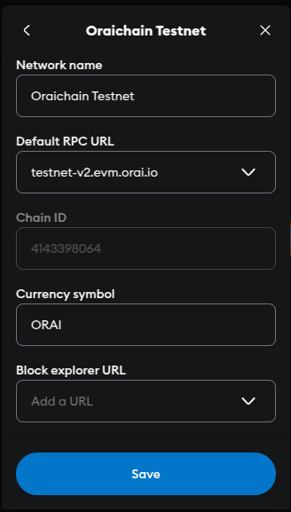

# OWallet

## OWallet: Cosmos x EVM in one Wallet&#x20;

OWallet supports both Cosmos-based and EVM-based networks including Cosmos Hub, Oraichain, Osmosis, Juno, Ethereum, BSC, and more.&#x20;

OWallet is developed based on Keplr and MetaMask source code and currently maintained by Oraichain Labs.&#x20;

Source code: [https://github.com/oraichain/owallet](https://github.com/oraichain/owallet)&#x20;

OWallet website: [https://owallet.dev](https://owallet.dev/)&#x20;

(You can create a pull request to add your network)

**Supporting chains:** Oraichain, **Injective**, OraiBridge, Kawaiiverse Cosmos,  Kawaiiverse EVM, **Cosmos Hub**, **Osmosis**, **Juno, Noble, Bitcoin-segwit,** **BNBChain, Ethereum, TRON.**&#x20;

## Key Features:&#x20;

\- Support Cosmos-based and EVM-based networks&#x20;

\- Enable IBC transfer&#x20;

## Sign  in with Owallet&#x20;

### Install Owallet

App Store: [IOS](https://apps.apple.com/vn/app/owallet/id1626035069)

Google Play Store: [Android](https://play.google.com/store/apps/details?id=com.io.owallet)

Google Web Store: [Extension](https://chrome.google.com/webstore/detail/owallet/hhejbopdnpbjgomhpmegemnjogflenga)

### Sign in to your wallet

To sign in, you have 3 options with Owallet as below.

A default wallet will be created on Oraichain if you choose to create a new wallet. Make sure to note the Mnemonic phrases down and keep it safe in case you need to import your wallet elsewhere.&#x20;

Note that you should not share Mnemonic/Private Key with anyone else including Oraichain members. \
\

