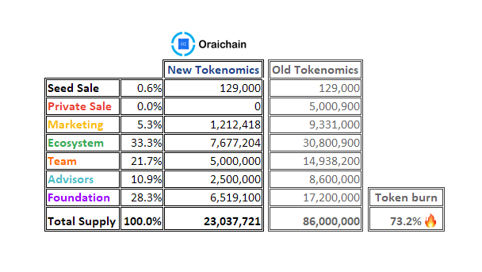
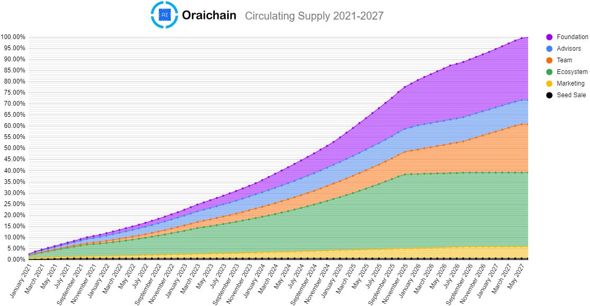
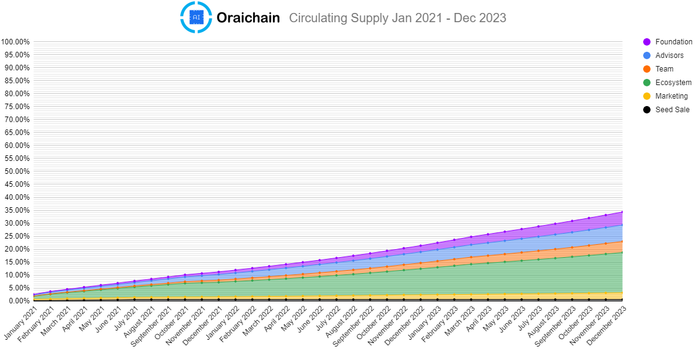

# Token Economics

When we call **ORAI**, it means that it is native ORAI tokens created and contained in the Oraichain network. At the beginning, we are basing on ERC20 to issue ORAI token on the Ethereum network that we call **ERC20-ORAI**.

### ORAI token distribution (%)

Updated Tokenomics and Distribution V3: [https://medium.com/oraichain/oraichain-tokenomics-v3-73-token-burn-and-key-updates-4e99d1972bcf](https://medium.com/oraichain/oraichain-tokenomics-v3-73-token-burn-and-key-updates-4e99d1972bcf)

**The token supply distribution is as follows:**

**ORAI token release schedule (%):**

### Token governance and use of funds

Funds raised in the seed and private rounds will be spent according to the following allocations:

* 60% technical and business development
* 20% marketing
* 10% operation
* 10% legal and audit fee

Funds are raised in ETH or fiat and then they are converted to stable coins in order to avoid crypto price’s volatility risk. ETH and stable coins are store in multi-signature wallets that require at least 3 out of 4 signatures from Oraichain founders.

### ORAI token utility

When ORAI mainnet is officially launched, the ORAI token is required to secure and power the decentralized oracle network of validators. The native ORAI token is used in different scenarios below:

* Staking for validators: all validators are required to stake ORAI in order to be selected to create a block or fulfill data requests.
* Transaction fee: the ORAI token is required in order to run an AI request sent to the Oraichain network.
* Participation in Oraichain Governance: the Oraichain network is organized in the DAO manner, all protocol upgrades and parameter changes must be voted by token holders.

#### Transaction fee

The token plays a role as transaction fee that is paid for parties as follows:

* Request-executing validators
* AI-API providers
* Testcase providers
* Block-creating validators.

The transaction fee is different depending on the fee requirement of request-executing validators, AI-API providers, and test-case providers. The transaction fee should be explicitly defined in MsgSetAIRequest of a request. When a request comes, request-executing validators must decide if they want to execute it. After that, a random validator, which is responsible for proposing a block will execute the request before firing an event to those request-executing validators.

Afterwards, these validators interact with test cases and AI APIs to create a MsgResultReport in the end. A report contains the data sources, test cases used, the validator creating the report, and the block height of it. Using this information, we can collect validators, test case owners, and data source owners involved in a specific block to reward them. Only those creating reports are able to receive the rewards. If there is more than one validator asked in the MsgSetAIRequest (ValidatorCount), the transaction fee is divided proportionally to the voting power of each validator.

#### How ORAI token is mined

There are two ways for miners to mine ORAI tokens. The first way is that the ORAI token is rewarded for each newly created block. The number of rewarded ORAI tokens will be decided later before the mainnet launch. In the Oraichain network, validators are responsible for creating new blocks and a random validator is chosen to do that. In order to become a validator, one needs enough ORAI tokens that are staked or delegated. Note that new ORAI tokens are only mined when a block contains one or more transactions with transaction fees. Such fees will be converted into tokens in the form of rewards for the validators.

The second way is briefly described above, in which the request-executing validators can earn some extra ORAI tokens by executing test cases and data sources. Similar to the first way, 70% of the total transaction fee is extracted as a reward for the first three parties mentioned earlier. The remaining 30% is saved to reward validators for the newly committed block. Nevertheless, this second way only occurs when there is at least a report broadcast to the Oraichain network at the end of a block.

#### ERC20-ORAI token and ORAI token (native)

There is a mechanism to synchronize ORAI tokens on the Oraichain network and ERC20-ORAI tokens on the Ethereum network. We will announce a conversion bridge later before the mainnet launch.

#### Inflation, staking, and slashing

In order to keep the value of ORAI token, holders must stake their token to the Oraichain network. The rewarding token is divided based on the number of tokens that a holder is staking to a validator.

Slashing is a mechanism to punish bad behavior of validators in aspects of AI API quality, response time, and availability.
