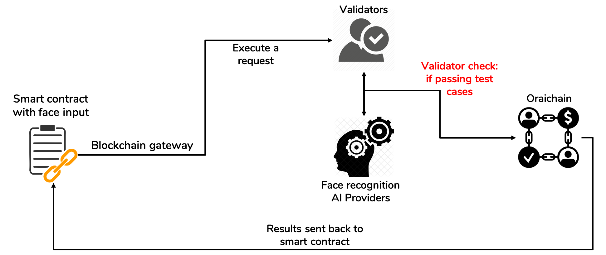

# Use Cases

AI will be the next big thing and upgrade of smart contracts in DApps. How to make smart contracts smarter with AI. We would like to introduce several use cases where smart contracts can leverage AI.

Oraichain also supports regular centralized applications in using AI APIs on the decentralized Oraichain marketplace. Users can find better AI providers with better price in this marketplace.

### Oraichain Data Hub — The Fundamental Hub To Empower Data Economy 

Oraichain AI Ecosystem welcomes a new fundamental hub on its vision to accelerate the deployment of blockchain technology to Artificial Intelligence academia and industry. This hub focuses on empowering the data economy with an essential Royalty Protocol developed by Oraichain. The Data Hub will provide all necessary tools to work with and to monetize data while preserving the royalties of creators throughout the future usage and resale of data!

_Access_ [_datahub.orai.io_](https://datahub.orai.io) _to experience the innovation!_

### New AI Marketplace

The marketplace is providing access to AI products and APIs aiming to become the one-stop-shop for Artificial Intelligence services.

Link (under maintenance): [https://market.orai.io](https://market.orai.io)

100+ API: [https://blog.orai.io/the-road-to-100-ai-apis-and-test-cases-on-the-oraichain-ai-marketplace-54e763dea7f4](https://blog.orai.io/the-road-to-100-ai-apis-and-test-cases-on-the-oraichain-ai-marketplace-54e763dea7f4)

### Yield farming using AI services on Oraichain (yAI)

Beta version: [https://yai.finance](https://yai.finance)

The yield farming based on Oraichain (namely yAI) has got inspiration from yearn.finance (YFI) that helps reduce the complexity of yield trading and provides trading strategies from crowdsourcing DAO voting. Instead of using crowdsourcing knowledge, Oraichain provides AI-based strategies as inputs to smart contracts.

There are three features in this use case:

* AI-based vaults: strategy is optimized based on the metric of ROI, Risk score, and Price prediction. Strategies are provided by AI providers on Oraichain.
* Metric of ROI, risk score, and price prediction of all pools and vaults getting from Oraichain.
* Tracking your investment on all pools and vaults getting from Oraichain.

### Flexible smart contracts using face authentication

There are several scenarios in which face authentication is very useful as follows:

* Using your face to get your balance instead of using a private key.
* Withdraw using your face
* Using your face in order to reset your private/public key pair.
* Using both your private key and face in order to execute a smart contract.

Using face authentication might be riskier than a private key, but it helps increase user experience. In cases of checking balance and withdrawing tokens to registered wallets, face authenticatiion is safe and convenient.

### Fake news detection using different AI providers from Oraichain

This use case focuses more on a regular application that wants to check if the news can be trusted. Oraichain provides a marketplace in a decentralized manner in which combining results from different providers is possible. If the providers want to receive payments, their APIs must pass the test cases, which is when the APIs return the correct results of your own test cases.

### More other use cases is coming soon

* Smart contracts help check if a product is fake in the supply chain.
* Smart contracts deciding a loan based on users’ credit score.
* Smart contracts automatically pricing game items based on their characteristics and DNA.
* Marketplace of automated diagnostics for X-ray images, spam classification, handwriting detection using OCR, and citizen ID card detection using OCR.
